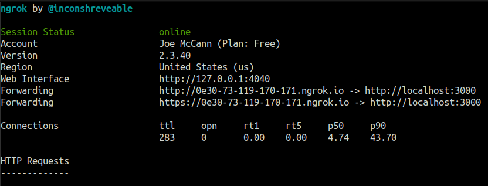

## Introduction

"Who are you?" may be the line sung by Roger Daltrey of The Who in their 1978 hit _Who Are You_, but it is also the fundamental question that Authentication answers.

Authentication is the process of determining whether or not a user is who they claim to be. You are likely familiar with the basic process. You sign up on a website with an email and password. The next time you log in you will be prompted for your email and password. If both your email and password are correct, the application verifies or _authenticates_ your identity.

But what if we've already gone through this process on another site? Wouldn't it be nice if we could somehow communicate with that site's authentication system and use it to authenticate the users on our site? This is precisely what [OmniAuth](https://github.com/omniauth/omniauth) allows us to do, specifically through the use of community-built strategies, or code that allows one to authenticate to a given provider, e.g. Facebook or GitHub. You know those "Login with Facebook" buttons? Yep, that's what we're talking about here.

### What does this post cover?

In this post, I will go over the steps I took to authenticate to GitHub in a Rails development environment using the [omniauth-github](https://github.com/omniauth/omniauth-github) gem, "the official OmniAuth strategy for authenticating to GitHub", along with [Devise](https://github.com/heartcombo/devise), and the [figaro](https://github.com/laserlemon/figaro) gem.

For some OAuth providers, you will need to install something like [ngrok](https://ngrok.com/), a nifty tool that exposes your local WebHost to the internet.

This guide will assume you already have Devise authentication setup for your app. See the link above for installation instructions.

## Outline

We will go over the following steps in more detail below.

1. Installing the [figaro](https://github.com/laserlemon/figaro) gem to securely store our OAuth Client ID and Client Secret.
2. [Registering a new OAuth](https://github.com/settings/developers) app with GitHub to use the GitHub API.
3. Configuring Omniauth GitHub and Devise.
4. (Optional) Installing [ngrok](https://dashboard.ngrok.com/get-started/setup) to expose localhost to the internet and obtain a functional callback URL.

_**Note**: setting up an ngrok tunnel is only necessary if your OAuth provider does not allow local callback URLs._
GitHub _does_ allow localhost callback URLs, so I will include this step as a courtesy if your OAuth provider disallows localhost callback URLs.

## Step 1 | Installing Figaro

The first step is fairly straightforward. We need a method for securely storing the keys we will obtain in Step 2. Figaro does this by creating a `config/application.yml` file and adding it to `.gitignore`. This way your secret key will never be pushed to GitHub and will stay on your local machine.

To install Figaro:

  1. Add it your Gemfile: `gem 'figaro'`
  2. Run `bundle install`
  3. Install figaro: `bundle exec figaro install`

See the gem [documentation](https://github.com/laserlemon/figaro) for more details. We will return to the `config/application.yml` file generated by `bundle exec figaro install` after we register a new OAuth app on GitHub (Step 2).

## Step 2 | Registering an OAuth App with GitHub

To authenticate to GitHub, we must tell GitHub who we are and that we will be requesting information from its API. To do this, we must register our application as a new OAuth app. Navigate to [GitHub](https://github.com). Login and under your profile picture, click on Settings. Scroll down a bit and click on Developer Settings. Click on OAuth Apps, and finally "New OAuth App".

1. Name your application
2. Under "Homepage URL", enter `http://localhost:3000` as this is the homepage of your application in development.
3. For "Authorization callback URL", enter `http://localhost:3000/users/auth/github/callback`
4. Click "Register Application".
5. Take note of your client id and client secret.

### Saving client id and secret with Figaro

In your Rails application, navigate to `config/application.yml` and save your client id and secret:


development:
  GITHUB_ID: < client id >
  GITHUB_SECRET: < client secret >


## Step 3 | Configuring Omniauth GitHub and Devise

1. Follow the directions in the [Devise Wiki](https://github.com/heartcombo/devise/wiki/OmniAuth:-Overview).  
Some notes:
    - The examples use omniauth-facebook, but you can essentially replace any occurrence of 'facebook' with 'github', or 'twitter', etc.
    - scope entails the permissions you request of the authenticated user. "Access to email, profile info, etc." `scope: 'user,public_repo'` below grants access to basic profile information and all public repo information. GitHub provides these scopes in their [docs](https://docs.github.com/en/developers/apps/building-oauth-apps/scopes-for-oauth-apps)
    - Don't forget to add a "Sign in with GitHub" link.
    - for the `config/initializers/devise.rb` part, your entry is accessing the environment variables set by Figaro:
    
      config.omniauth :github, ENV['GITHUB_ID'], ENV['GITHUB_SECRET'], scope: 'user,public_repo'
    

## Step 4 (Optional) | Installing Ngrok

### why install ngrok?

- ngrok is a tool that exposes a local web server to the internet. The colloquial term for this is a _tunnel_.
- ngrok allows us to use a callback URL in development when an OAuth provider does not allow local callback URLs.
- The callback URL is essentially where a user is redirected after authenticating to a third party service.
- Some OAuth providers require that this URL be public, thus the need for a tool like ngrok.
- After an application, located at `localhost:3000` sends a request for authentication to the OAuth provider's API, the OAuth provider "calls back" the publicly exposed WebHost's URL and the application now has an authenticated user. 
- For GitHub, we did not need to publicly expose our localhost server. We simply used `http://localhost:3000/users/auth/github/callback` in Step 2 above.

To install ngrok follow the [instructions](https://ngrok.com/download):

1. `snap install ngrok` (Ubuntu) or `brew install ngrok/ngrok/ngrok` (Mac)
2. [Sign up](https://dashboard.ngrok.com/signup) for an account to get your authtoken.
3. From your home directory: `ngrok authtoken <token>`
4. Start a tunnel. For a Rails app, use port 3000. `ngrok http 3000`

The final command, `ngrok http 3000`, will bring up the ngrok UI:

- Note the forwarding URL.
- Return to your application's settings and add `/users/auth/< insert_provider_name >/callback` to the end of the forwarding URL.

## Final Steps

- Navigate to localhost:3000, or, if you're using ngrok, your ngrok forwarding URL (Ctrl+click from terminal), and click the "Sign in with GitHub" link you made earlier.
- You should now be able to authenticate a GitHub user in your application in Development. Try it out with your own GitHub account!
- If you're using ngrok for your Authorization callback URL, it may be necessary to add your ngrok domain to your list of allowed hosts in `config/environments/development`:

  config.hosts << "0e30-73-119-170-171.ngrok.io"

- This will need to be changed if you close the terminal session that holds your ngrok session.

### To move this setup to Production

1. Return to Step 2:
     - On GitHub application page, update your "Homepage URL" to
     `< your app's production domain name >`
     - Update "Authorization callback URL" to `< your app's production domain name >/users/auth/github/callback`.
2. Update your `config/application.yml` file to include a production environment.
3. Set Heroku config variables so Heroku can access your application keys
     - `heroku config:set GITHUB_ID=github_id_key_here`
     - `heroku config:set GITHUB_SECRET=github_secret_key_here`
4. Deploy to Heroku

#### Reflection

I was quite happy when I saw the "Successfully authenticated from Github account." flash message. Getting this to work was an exercise in patience and reading documentation slowly and carefully. Authentication is a deep topic and I feel I have only scratched the surface. I hope this post was a helpful guide on how to setup OmniAuth in a development environment. Before we walk, we must crawl. Before we deploy to production, we must struggle in development.

Photo by <a href="https://unsplash.com/@brett_jordan?utm_source=unsplash&utm_medium=referral&utm_content=creditCopyText">Brett Jordan</a> on <a href="https://unsplash.com/s/photos/authenticity?utm_source=unsplash&utm_medium=referral&utm_content=creditCopyText">Unsplash</a>
  